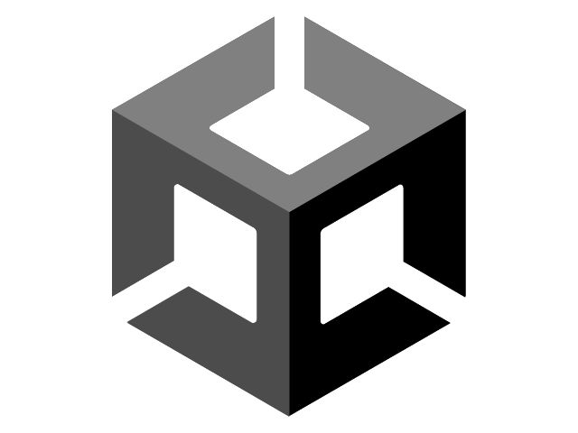
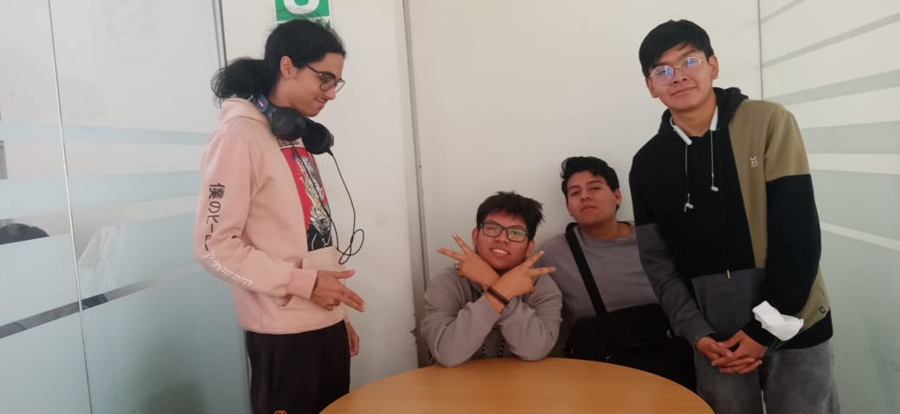
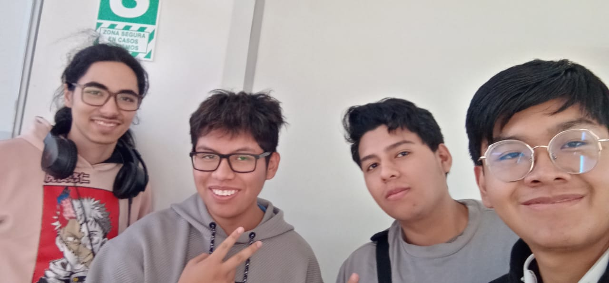
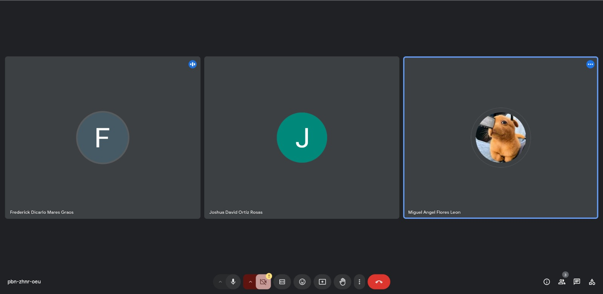
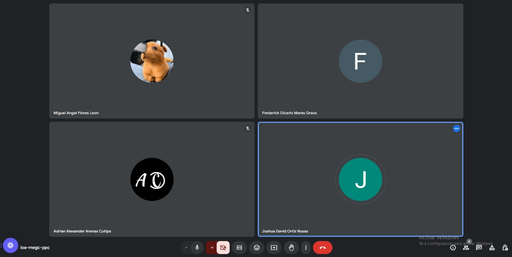

<table align="center">
    <thead>
        <tr>
            <td></td>
            <th>
                <span style="font-weight:bold;">UNIVERSIDAD LA SALLE</span><br />
                <span style="font-weight:bold;">FACULTAD DE INGENIERÍA DE SOFTWARE</span><br />
            </th>
        </tr>
    </thead>
    <tbody>
        <tr><td colspan="3"><span style="font-weight:bold;">Formato</span>: Guía de Evidencia 4</td></tr>
    </tbody>
</table>

<div align="center">
    <span style="font-weight:bold;">GUÍA DE LA EVIDENCIA</span><br />
</div>

<div>
    <table border="1" align="center">
        <thead>
            <tr><th colspan="3">INFORMACIÓN BÁSICA</th></tr>
        </thead>
        <tbody>
            <tr>
                <td colspan="2">
                    <table>
                        <tr><td>ASIGNATURA:</td><td>Lenguaje de programación 3</td></tr>
                        <tr><td>TÍTULO DEL TRABAJO:</td><td>Despliegue de GUI sin funcionalidad</td></tr>
                        <tr>
                            <td>NÚMERO DEL TRABAJO:</td><td>01</td>
                            <td>AÑO:</td><td>2024</td>
                            <td>NRO. SEMESTRE:</td><td>IV</td>
                        </tr>
                        <tr>
                            <td colspan="6">DOCENTES:
                                <ul>
                                    <li>Richart Smith Escobedo Quispe - rescobedoq@unsa.edu.pe</li>
                                </ul>
                            </td>
                        </tr>
                        <tr>
                            <td colspan="6">INTEGRANTES:
                                <ul>
                                    <li>Mares Graos Frederick Dicarlo (100%)</li>
                                    <li>Frontado Fajardo Abimael Ernesto (100%)</li>
                                    <li>Gamio Huaman Christofer Alberto (100%)</li>
                                    <li>Flores Leon Miguel Angel (100%)</li>
                                    <li>Ortiz Rosas Joshua David (100%)</li>
                                </ul>
                            </td>
                        </tr>
                    </table>
                </td>
                <td>
                    <table>
                        <tr><td align="center">The Unity</td></tr>
                        <tr><td style="border-top: 1px solid #000;"></td></tr>
                        <tr><td align="center"></td></tr>
                    </table>
                </td>
            </tr>
        </tbody>
    </table>
</div>


## ÍNDICE

- [Tablero de Commits](#tablero-de-commits)
- [OBJETIVOS, TEMAS Y MATERIALES DE APOYO](#objetivos-temas-y-materiales-de-apoyo)
    - [OBJETIVOS](#objetivos)
    - [Lenguaje y Motor](#lenguaje-y-motor)
    - [MATERIAL DE APOYO](#material-de-apoyo)
        - [Historia](#historia)
        - [Resumen](#resumen)
        - [Actualidad (5 años tras el abandono del “Cloudbuster”)](#actualidad-5-años-tras-el-abandono-del-cloudbuster)
        - [Personajes](#personajes)
            - [Protagonista](#protagonista)
            - [Personajes Secundarios](#personajes-secundarios)
        - [Ubicaciones](#ubicaciones)
        - [Objetos](#objetos)
    - [CONTENIDO DE LA GUÍA](#contenido-de-la-guía)
        - [INSTALACIÓN DE UNITYHUB Y UNITY](#instalación-de-unityhub-y-unity)
        - [ABRIENDO EL PROYECTO EN UNITY](#abriendo-el-proyecto-en-unity)
- [PRUEBAS DE REUNIONES](#pruebas-de-reuniones)
- [REFERENCIAS](#referencias)

## **Tablero de Commits**

| Nro. | Autor |Código |Commits |
| ------------- | ------------- | ------------- | ------------- |
| 1  | AFrontado | 1cb3fd7 | añadiendo la historia base del juego |
| 2  | AFrontado | da24e9b | añadiendo la historia base del juego |
| 3  | Fmares | 03a2e71 | Se Subio la base de Fondo_Exterior.md |
| 4  | Fmares | 3667ff2 | Se subio el fondo base de Consejo.md |
| 5  | MFlores | 2f62ae5 | Subiendo link de vistas en canva |
| 6  | JOrtiz | 5287930 | Create README_INFORME.md |
| 7  | JOrtiz | 79f1a1e | README inicial |
| 8  | JOrtiz | 503e459 | Modificaciones del README_INFORME.md |
| 9  | JOrtiz | 00744dc | Creando Tablero de Commits README_INFORME.md |
| 10  | MFlores | 5a1cbc5 | Adjuntando evidencias de las reuniones en la semana |
| 11  | MFlores | 44e5289 | Subiendo Proyecto de Unity |
| 12  | Fmares | 0bdebf0 | Se subio el link con el GUI del menu principal con funciones | Se Subio el Proyecto migrado a Unity 6.
| 13  | JOrtiz | 82f8db4 | Explicación de la creación y forma de conexión de la base de datos |
| 14  | Fmares | 30df958 | Se Subio el Proyecto migrado a Unity 6. |
| 15  | JOrtiz | 4dba0d6 | Documentación del proyecto |

## OBJETIVOS, TEMAS Y MATERIALES DE APOYO

### OBJETIVOS

- Realizar un GUI no funcional de un juego en Unity.

### Lenguaje y Motor
- Lenguaje: Csharp
- Motor: Unity (Versión 2021.3.1f) y (Versión 6000.0.26f1) (Unity 6)

# MATERIAL DE APOYO

Para realizar el GUI y posteriormente desarrollar el juego se seguira la historia desarrollada para  el susodicho, la cuál es la siguiente, además de diseños propios para el menú y demás funcinalidades.

# Historia
---
## BY2002

## Historia - Guión

Csilla, planeta ubicado en zona desconocida, en el pasado gracias a un mineral descubierto por científicos de la división de ciencias de la, en aquel entonces, especie dominante del planeta, unos seres humanoides, (Físicamente igual a los terrícolas), que ya para entonces habían realizados avances técnologicos sin precedentes, conocidos como “Chiss”.
Este mineral fue llamado “Nyix” el cuál poseía propiedades energéticas sin igual a las de cualquier otro elemento o componente en el planeta, sin embargo el descubrimiento se realizó en una zona boscosa del planeta, la cuál estaba gobernada por otra especie, unos seres de apariencia monstruosa con gran poder, pero inteligentes y en su mayoría pacífica llamados; los Grysk, sin embargo, pese a ser numéricamente superiores a los Chiss al ser una especie pacífica y estar aislados del territorio Chiss, no causaban ningún problema; aunque los Chiss los despreciaban y temían por su poder. 
Al ver que los Chiss querían llevarse aquel mineral que consideraban “Maldito”, los Grysk quisieron convencer a los humanoides de abandonar la zona y aquel mineral, ya que solo traería destrucción; los Chiss ignorando las advertencias se llevaron todo lo que pudieron.
Con el tiempo su nuevo hallazgo llevo a la especie a un nuevo nivel de avances sin precedentes, principalmente energéticos y armentísticos; al ver que podían diseñar armas capaces de asesinar a los Grysk, a quienes se los consideraba casi invencibles, los Chiss consideraron llevar a cabo una purga de aquella especie y borrarla de la faz del planeta.
Sin embargo, no se dieron cuenta de que aquello que les habían advertido termino siendo realidad, el “Nyix” el cuál al estar en contacto con el ambiente era prácticamente tóxico, aunque no para los Chiss; sino, para quienes les advirtieron del peligro que podría venir.
En la antigüedad los Grysk le temían al “Nyix” debido a que este al estar en contacto con alguno de ellos, era capaz de convertirlos en seres los cuales su conciencia parecía seguir intacta, pero ya no respondían a ella, sino solo a sus ansías de matar lo que se pusiera en su camino, los Chiss en su avaricia habían provocado su casi total extinción, pese a tener armas capaces de hacer frente y matar a estos seres monstruosos, poco a poco fueron diezmados, y los pocos sobrevivientes se vieron obligados a refugiarse en las montañas tan alto como pudieran para que no os alcanzaran
Pero antes de aquello los Chiss crearon un artefacto pequeño pero poderoso, el “Cloudbuster”, el cuál tendría la capacidad, de liberar un gas el cuál al liberarse en el aire sería capaz de asesinar a todos los Grysk infectados de “Nyix” atacando directamente su propio sistema contaminado y erradicar tanto al contaminante, como al contaminado; sin importar cuan pequeño fuera el rastro de “Nyix”, tras probar en uno. Sin embargo, nunca fue usado debido a que los Grysk atacaron el complejo donde se guardaba el arma y los Chiss tuvieron que dejar atrás su última esperanza.

## Resumen

El planeta Csilla estaba habitado por dos especies: los Chiss, humanoides avanzados tecnológicamente, y los Grysk, seres monstruosos pero pacíficos, quienes habitaban las zonas boscosas. Los Chiss descubrieron un mineral llamado Nyix en territorio Grysk, que tenía increíbles propiedades energéticas. A pesar de las advertencias de los Grysk sobre su peligrosidad, los Chiss lo extrajeron y lo usaron para crear armas poderosas, impulsando su desarrollo tecnológico.

El “Nyix”, sin embargo, resultó tóxico para los Grysk. Al entrar en contacto con él, los Grysk afectados se convertían en criaturas violentas, perdiendo control de sí mismos y atacando sin piedad. Esto llevó a la casi extinción de los Chiss, quienes tuvieron que refugiarse en las montañas para evitar el a los Grysk contaminados.

Antes de su desaparición, los Chiss desarrollaron un dispositivo que podía liberar un gas letal para eliminar a los Grysk infectados y cualquier rastro de Nyix. Sin embargo, nunca llegaron a usarlo, ya que los Grysk atacaron el complejo donde se guardaba el arma, obligando a los Chiss a abandonar su última esperanza para controlar la amenaza.

## Actualidad (5 años tras el abandono del “Cloudbuster”)

Un Chiss adulto llamado Eli Vanto, quien formaba parte de una comunidad llama “By2002” nombrada así al ser inicialmente creada por 2002 Chiss, ahora menos, sufría de una gran ira, su familia había sido víctima de los Grysk infectados, tenía rencor y buscaba vengarse de a quienes solo consideraba monstruos, antes del exilio a las montañas era un científico y participo en el desarrollo del “Cloudbuster”, y contantemente cada día salía a explorar, para determinar que tan posible era regresar al complejo donde se había abandonado el arma, al terminar la investigación que pudo realizar, decidió que era posible y que realizaría aquella tarea acompañado de otros Chiss. Sin embargo; al presentar su plan al consejo quienes designaban las misiones para cada Chiss, estos vieron su plan como una misión suicida, y se negaron a apoyarlo.
 Eli frustrado pero determinado, principalmente por el rencor, decide embarcarse el solo en este viaje apoyándose de las herramientas que tiene a su disposición, esperando cumplir su venganza por lo que los Grysk le arrebataron, y para cuidar a su comunidad aunque no quieran apoyarlo, sin saber que cumplir su objetivo singnificaba también acabar con los Chiss, recordemos que el “Cloudbuster” es capaz de acabar con cualquiera que se encuentre minimamente contaminado de “Nyix” y los Chiss aunque no mutados, si estaban contaminados, ya que el aire, estaba contaminado por este mineral.

## Personajes

### Protagonista:

#### Eli Vanto:
-	Aproximadamente de 37 años, es un hombre de tez blanca, cabello marrón, ojos negros, tiene un polo negro, una casaca gris, pantalones azules, zapatos cafés, mochila (color a elegir), una espada y una pistola especiales creadas para enfrentar Grysk.

-	Un hombre que sufre por dentro y lamenta lo que le ocurrió a su familia, y desea vengarse acabando con todos los Grysk mediante el “Cloudbuster”, en este viaje se vera en situaciones que harán, que termine usando el arma o que no lo haga y decida regresar a su comunidad.

### Personajes Secundarios

#### Karyn Faro:

Una exploradora Chiss que acompaña a Eli en su viaje, al estar también ella disconforme con la decisión de no apoyar la idea de Eli que puede ser su única salvación, y también velar que Eli no acabe muriendo:

Mujer de la misma edad de Eli, de tez blanca, cabello negro corto, polo color plomo, casaca color verde, pantalón negro, zapatos color marrón, mochila (color a libertad), mismas armas que Eli, con el añadido de tener más experiencia al ser exploradora.

#### -	Gillad Pellaon: 

Un Chiss sobreviviente que vive en soledad en una antigua zona de guerra del pasado, se las arregla para sobrevivir por su cuenta, aunque no acompaña a Eli, si se le aparece en ciertas ocasiones para darle consejos:

Hombre de aproximadamente 47 años en soledad, lleva una capucha negra algo rasgada, al igual que un polo plomo algo rasgado, pantalones azules en mal estados, y zapatos marrón sucios, de tez blanca y con algunas canas, experto en supervivencia, armas como espada, pisola, cuerdas y otros elementos que guarda bajo su capucha y en una mochila( color a elegir, pero en mal estado).

## Ubicaciones

### Csilla:

En la historia Eli se encontrará enla zona de prado y boscosa del planeta, el complejo donde se encuentra el “Cloudbuster”, un pequeño edificio estilo cuadrado de color gris, el interior, solo importaría la sala donde esta el “Cloudbuster”, y el techo donde puede o no usar el arma.

## Objetos

### Nyix:

Mineral similar a una piedra de color morado

### Cloudbuster:

Un cilindro de la mitad del tamaño de Eli que tiene algunos botones, el impotante y que libera el gas, es el azul.

</details>

## CONTENIDO DE LA GUÍA

### INSTALACIÓN DE UNITYHUB Y UNITY

A continuación, se presenta una versión mejorada de la redacción académica:

Para iniciar con este proyecto, primero procederemos a instalar nuestro entorno de desarrollo integrado (IDE), siendo Unity el componente central de este repositorio basado en C#. 

Es necesario utilizar **Unity Hub** para ingresar con la cuenta institucional y obtener una licencia personal. En primer lugar, descargaremos **Unity Hub** desde su página oficial [Unity Hub](https://unity.com/es/unity-hub), donde también encontraremos el procedimiento detallado de instalación, el cual es bastante sencillo para sistemas operativos Windows.

Una vez instalado Unity Hub, será necesario crear una cuenta o iniciar sesión con una cuenta existente. Dentro de Unity Hub, localizamos el ícono de engranaje en la esquina superior derecha, hacemos clic en él y accedemos al apartado de **Licencias**. Allí, seleccionamos la opción de **añadir licencia**, y luego elegimos la opción **Cuenta personal**. Después de completar este paso, regresamos al menú principal para continuar con la instalación.

En segundo lugar, procederemos a instalar Unity a través de Unity Hub. Para ello, accedemos al apartado **Instalaciones** y seleccionamos la versión de Unity que preferimos. Alternativamente, también podemos acceder a la página oficial de Unity para obtener más detalles sobre las versiones disponibles [Unity](https://www.unity3d.com).

## Commit Vital:

## **Tabla**
| Nro. | Autor |Código |Commits |
| ------------- | ------------- | ------------- | ------------- |
| 12  | Fmares | 0bdebf0 | Se subio el link con el GUI del menu principal con funciones |

En este commit se encuentra la lista de archivos en Drive con un link, con todos los avances realizados para el GUI funcional.

### Link:

- https://drive.google.com/file/d/1hsm1kbqnc4beKQm6nlYAnuvyWN0nSWtC/view?usp=sharing

## Funcionalidad del Proyecto:
### MenuMovimiento 
#### 🛠️ Funcionalidad

El script mueve un elemento de UI basado en la posición actual del mouse, escalando el movimiento mediante un factor configurable (`movementQuantity`).

#### 📋 Requisitos
- Unity 2020.1 o superior.
- Un objeto de UI con un componente `RectTransform`.

#### 📄 Código

```csharp
using System.Collections;
using System.Collections.Generic;
using UnityEngine;

public class MenuMovimiento : MonoBehaviour
{
    // Declaramos las variables aquí para que sean accesibles en toda la clase
    private float mousePosX;
    private float mousePosY;

    [SerializeField] float movementQuantity;
    // Start is called before the first frame update
    void Start()
    {
        // Puedes inicializarlas aquí si es necesario
    }

    // Update is called once per frame
    void Update()
    {
        mousePosX = Input.mousePosition.x;
        mousePosY = Input.mousePosition.y;

        this.GetComponent<RectTransform>().position = new Vector2(
            (mousePosX / Screen.width) * movementQuantity + (Screen.width / 2),
            (mousePosY / Screen.height) * movementQuantity + (Screen.height / 2));
    }
}

```
✨ Cómo funciona
Captura la posición del mouse: El script usa Input.mousePosition para obtener las coordenadas actuales del mouse (X, Y).

Calcula la posición del elemento: Se ajusta la posición del elemento de UI en proporción al movimiento del mouse, escalado por movementQuantity.

Actualiza la posición del objeto: Usa el componente RectTransform para mover el objeto en tiempo real.

⚙️ Configuración
Añade el script a un objeto de UI en tu escena.
Configura el valor de movementQuantity desde el inspector para controlar la sensibilidad del movimiento.

### Scripts

El script pertenece a la clase MenuMovimiento. Cada script en Unity es una clase que hereda de una clase base, generalmente MonoBehaviour, lo que permite integrarse con el ciclo de vida de Unity.
En el script proporcionado, se demuestra cómo un script puede personalizar el comportamiento de un objeto de UI:

Captura datos en tiempo real (posición del mouse).
Realiza cálculos basados en los datos.
Aplica los resultados directamente al componente asociado, actualizando la interfaz visual.

## Base de Datos:

Para la creación de la base de datos y su conexión a el proyecto se usaron los siguientes elementos.

### DEPENDENCIAS .NETStandard 2.0

Este proyecto requiere las siguientes dependencias para garantizar su funcionamiento correcto. A continuación, se incluye una descripción de cada una:

#### Dependencias Principales

#### **BouncyCastle.Cryptography (>= 2.3.1)**  
Proporciona funciones avanzadas de criptografía, incluyendo algoritmos de cifrado, firmas digitales y generación de claves.

#### **Google.Protobuf (>= 3.26.1)**  
Librería para serialización y deserialización basada en Google Protocol Buffers, utilizada para intercambiar datos estructurados eficientemente.

#### **System.Memory (>= 4.5.5)**  
Ofrece compatibilidad con tipos de memoria de alto rendimiento como `Span<T>` y `Memory<T>`.

#### **System.Buffers (>= 4.6.0)**  
Ayuda a administrar buffers y memoria en .NET, optimizando operaciones que manejan grandes cantidades de datos.

#### **System.Numerics.Vectors (>= 4.6.0)**  
Proporciona soporte para vectores SIMD (instrucciones de un solo conjunto de datos) para cálculos de alto rendimiento.

#### **System.Runtime.CompilerServices.Unsafe (>= 6.1.0)**  
Permite realizar operaciones de bajo nivel que no son seguras por defecto, como trabajar directamente con punteros.

#### **K4os.Compression.LZ4.Streams (>= 1.3.8)**  
Extiende la funcionalidad de compresión LZ4 para trabajar con flujos de datos en tiempo real.

#### **K4os.Compression.LZ4 (>= 1.3.8)**  
Implementación del algoritmo de compresión LZ4 para procesamiento de datos rápido y eficiente.

#### **K4os.Hash.xxHash (>= 1.0.8)**  
Proporciona una implementación de xxHash, un algoritmo rápido de hash para verificar la integridad de los datos.

#### **System.IO.Pipelines (>= 5.0.2)**  
Librería diseñada para operaciones eficientes de entrada/salida, optimizando el uso de buffers.

#### **System.Threading.Tasks.Extensions (>= 4.5.4)**  
Extiende las capacidades de las tareas asíncronas para mejorar el manejo de concurrencia en .NET.

#### **System.Configuration.ConfigurationManager (>= 8.0.0)**  
Proporciona acceso a configuraciones tradicionales de aplicaciones .NET, como `App.config` o `Web.config`.

#### **System.Security.Cryptography.ProtectedData (>= 9.0.0)**  
Brinda soporte para proteger datos sensibles con cifrado.

#### **System.Diagnostics.DiagnosticSource (>= 8.0.1)**  
Ofrece capacidades avanzadas para el diagnóstico de aplicaciones .NET.

#### **System.Runtime.Loader (>= 4.3.0)**  
Permite cargar ensamblados dinámicamente en tiempo de ejecución.

#### **System.Security.Permissions (>= 8.0.0)**  
Gestiona permisos de seguridad y acceso en aplicaciones .NET.

#### **System.Security.AccessControl (>= 6.0.0)**  
Brinda herramientas para configurar y gestionar listas de control de acceso (ACLs).

#### **System.Security.Principal.Windows (>= 5.0.0)**  
Proporciona integración con los sistemas de seguridad y autenticación de Windows.

#### **Microsoft.NETCore.Platforms (>= 5.0.0)**  
Define las plataformas compatibles para aplicaciones .NET Core.

#### **System.Text.Encoding.CodePages (>= 8.0.0)**  
Permite el uso de codificaciones de texto adicionales, como las páginas de códigos.

#### **System.Text.Json (>= 8.0.4)**  
Ofrece soporte nativo para serialización y deserialización de JSON con alto rendimiento.

#### **Microsoft.Bcl.AsyncInterfaces (>= 9.0.0)**  
Incluye las interfaces necesarias para implementar funciones asincrónicas en .NET.

#### **System.Text.Encodings.Web (>= 9.0.0)**  
Proporciona herramientas para trabajar con codificación segura de contenido web.

#### **ZstdSharp.Port (>= 0.8.0)**  
Implementación de Zstandard, un algoritmo de compresión moderno para trabajar con datos comprimidos.

---

#### DEPENDENCIAS .NET Framework 4.6.2

En caso de ser necesario se cambiaria a esta versión para tener mejor rendimiento.


### NuGet Gallery  

En este proyecto se utilizaron paquetes de la Galería de NuGet para gestionar dependencias y agregar funcionalidades clave. NuGet simplifica la integración de bibliotecas externas en proyectos C# al automatizar la descarga, instalación y gestión de versiones.

#### Facilita la Gestión de Dependencias:

NuGet permite gestionar de manera sencilla las dependencias del proyecto. Al requerir de una librería externa, NuGet facilita la instalación, actualización y configuración de estas dependencias.
Por ejemplo, al hacer la base de datos o implementar hashing, en lugar de escribir todo el código desde cero, se busca un paquete NuGet que ofrezca estas funcionalidades listas para usar.

#### Acceso a Bibliotecas y Herramientas de Calidad:

NuGet Gallery alberga miles de paquetes que han sido verificados y pueden ser utilizados directamente en el proyecto. Esto ahorra tiempo y esfuerzo a nuestro grupo, ya que pudemos reutilizar código confiable y probado en lugar de tener que implementarlo por nosotros mismos.
Paquetes como Newtonsoft.Json para manipulación de JSON o Dapper para la interacción con bases de datos SQL son ejemplos populares.

### GitHub Unity-with-MYSQL

En este GitHub se obtuvo información adicional para desarrollar la conexión entre el proyecto a realizar y la base de datos en Sql:
- Se detallan ciertos paquetes, assests, plugins, y demás archivos usados para llevar a cabo el desarrollo de la conexión de la base de datos en Sql con Unity.

### Plugins

Para conectar Unity la base de datos SQL, se usan plugins o bibliotecas que manejen la comunicación entre Unity y la base de datos.
Instalar el Plugin:

- Se descargó la librería MySQL.Data desde NuGet.
- Se agregó el archivo DLL correspondiente al proyecto de Unity.

### Objetivo final

Como se pidió se creo una base datos hecha en sql y programada en unity utilizando Nuget, la cual se encarga de guardar datos del usuario al ingresar al juego realizado por nosotros; como por ejemplo su gmail, contraseña, etc; además en el caso de la contraseña se programó para poder resguardar el dato introducido mediante hashing, aprovechando el apoyo de NuGet.

### ABRIENDO EL PROYECTO EN UNITY

En este repositorio. Exactamente en la carpeta **Evidencia_4**. Se almacena la carpeta con el proyecto en desarrollo. 

## PRUEBAS DE REUNIONES
---
### 31/10/24

### 6/11/24

### 7/11/24

### 10/11/24

### 21/11/24

## REFERENCIAS
- https://unity.com/es/unity-hub
- https://www.unity3d.com
- https://github.com/Hanslen/Unity-with-MYSQL
- https://www.nuget.org/packages

